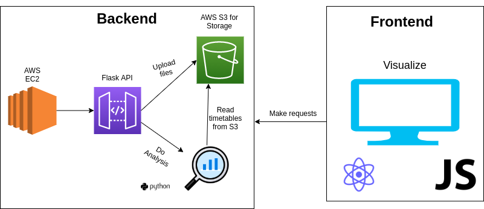

# TimeTableVisualizerAPI

## Architecture diagram of the project



## Project description

This project was made as a requirement to pass "Software Architecture and Design" at ISCTE. 

### Goal of the project
The main objective of the project was to help decision makers at ISCTE evaluate their generated schedules for the upcoming semester. This includes analysis of the given study plan and providing a frontend where users can upload their schedules and then compare the metrics that we thought are important. 

In order to do the analysis we were given two .csv files, one with the attributes of the classrooms and the other for classes. With the help of these two documents we were able to formulate a couple of metrics that we considered important. 

We believed that by visualiing these metrics we can aid the decision making of the board of the university, thus providing real value. Sadly, communications with board members was not possible, we had to rely on our intuition on what we think is important both for the board members and the students themselves. Obviously, we had more experience regarding what students might not like about their study plan :sweat_smile:

### Decisions during the process

As it was a group project, it was important for us to make working together easy and fit everyones needs. During our first project planning session we realized some of us have done similar tasks before, but as we are still students and we have a lot of room to improve, we decided to try new technologies as we felt eager to learn / have some experience with them. 

As we couldn't avoid making the frontend ourselves, we decided to go with React as it's currently fairly popular and it matched our purpose. Even before the projet began we assumed that the frontend will mainly be used for visualisations, and we heard about a lot of packages and libraries that will help us solve the arising problems. 

For the analysis part, we were unsure whether we could handle everything on the server-side, so we decided to have a small backend. This meant that we will spin up a S3 bucket where we can store the uploaded files, but we still needed to do the analysis. 

As some of us already had some experience with doing data analysis in Python, we decided to go with that. However, we still needed to connect these two parts of the infrastructure, which is where creating a Flask API becomes useful. By having this API handle all the analysis of the study plans and send the calculated metrics as a json to the frontend we managed to connect these two interfaces. 

In order to make the API work, we needed a server to host it. For this, we used an AWS EC2 instance, because it was the simplest and cheapest (=free) solution. 
After setting up the security rules we managed to host our public API endpoint on this instance, and it was perfect for us. 

We were also required to host the project on a publicly available website, which for a bit of time caused us some headache. Later we realized that deploying it with Heroku is not only free but also fairly simple.

## Setting up the infrastructure

In order to develop this project even further, you need to set up the infrastructure first (as our AWS EC2 + S3 is connected to our own account)

To do that, follow this guide.

1. Register an account on AWS
1. Set up a billing alarm 
1. Create a free EC2 instance (with a private key so later you can ssh into it) which will host your public API endpoint
1. Set up the security rules

Inbound rules
| IP version | Type       | Protocol | Port | Source    |
|------------|------------|----------|------|-----------|
| Ipv6       | HTTP       | TCP      | 80   | ::/0      |
| Ipv4       | HTTP       | TCP      | 80   | 0.0.0.0/0 |
| Ipv4       | SSH        | TCP      | 22   | your_ip   |
| Ipv4       | Custom TCP | TCP      | 5000 | 0.0.0.0/0 |
| Ipv4       | HTTPS      | TCP      | 443  | 0.0.0.0/0 |
| IPv6       | Custom TCP | TCP      | 5000 | ::/0      |

Outbound rules
| IP version | Type        | Protocol | Port | Source    |
|------------|-------------|----------|------|-----------|
| Ipv4       | HTTPS       | TCP      | 443  | 0.0.0.0/0 |
| Ipv4       | All traffic | All      | All  | 0.0.0.0/0 |
| Ipv4       | HTTP        | TCP      | 80   | 0.0.0.0/0 |

1. Create an S3 bucket where you will store your .csv files
1. Once you have created the EC2 instance SSH to it with your private key, using the following command
``` ssh -i "your_key.pem" ubuntu@your_public_dns```
1. After you managed to SSH into it, clone the project
1. Install the required dependencies
1. Start the API by (it will run on )
``` flask run --host=0.0.0.0 ```
1. In case the endpoint doesn't work, change it to your public dns with port 5000, for example(http://ec2-1-234-567-999.eu-central-1.compute.amazonaws.com:5000/get_what_i_want)


## Future ideas

The project itself is far from complete, but it is fairly easy to add new features to it. 
During the implementation we came up with other ideas, most of which we couldn't implement because of the shortage of time

Some of the ideas were the following:
1. 
1.
1. 

## Project TODOs

1. Add Architecture diagram 
1. Add black + flake8 to python api 
1. Add description of the problem
1. Add setup instructions
1. AWS S3 + EC2 setup with env variables

## Metrics to implement

More to be added later. 

1. Metrics for the radarplot
    1. Number of classrooms free for at least 2 hours
        1. Function: *get_total_free_hours_with_minimum_limit*
    1. Number of classrooms free for a whole day
        1. Function: *get_number_of_classrooms_free_for_the_whole_day*
    1. Number of overbooked classes
        1. Function: *get_total_overbook_classes*
    1. Number of times students need to change rooms (Between classes or after one class has finished and before the next starts)
        1. Function: *get_total_class_changes*
    1. Total number of classes with unspecified date
        1. Function: *get_total_number_of_classes_with_unspecified_date*
    1. Rate of matching between assigned classroom and requested classroom characteristics
        1. Function:  
    1. Number of classrooms not used during the whole semester
        1. Function: *get_total_classrooms_unused_in_semester*
1. Basic barplots
    1. Number of classrooms (x) and sits (y)
        1. Function: *get_number_of_classroom_and_sits*
    1. Number of classrooms unused (y) per day (x)
        1. Function: *get_number_of_classrooms_unused_per_day*
    1. Total slots needed for each week (Total slot = Sum of students that need to sit the class during the week), timeseries plot
    1. Number of classes for each weekday 
        1. Function: *get_classes_per_days*
1. Heatmap / Density map
    1. Timetable with number of classes being in that given time period (2 hours windows)
    

## Extra ideas
    1. Plot for usage of each classroom 

## Things that might be handy later
1. [Swagger for building documentation, flasgger for Flask APIs](https://github.com/flasgger/flasgger)
1. [Best practices for Flask API development](https://auth0.com/blog/best-practices-for-flask-api-development/)
